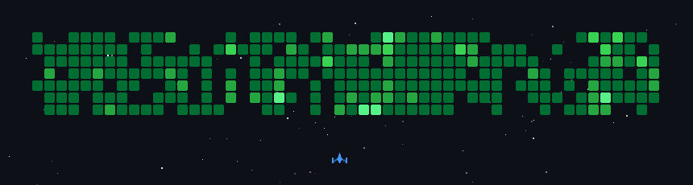

# sentimental programmer~ 🤔

<!--
**ysoftman/ysoftman** is a ✨ _special_ ✨ repository because its `README.md` (this file) appears on your GitHub profile.
-->

<!-- https://github.com/Ileriayo/markdown-badges -->
<!-- https://github.com/antonkomarev/github-profile-views-counter -->

<!-- github-readme-stats vercel 공용 인스턴스 rate limit 문제로 로컬 SVG 사용 -->

<picture>
  <source media="(prefers-color-scheme: dark)" srcset="github-contribution-grid-snake-dark.svg" />
  <source media="(prefers-color-scheme: light)" srcset="github-contribution-grid-snake.svg" />
  
</picture>
